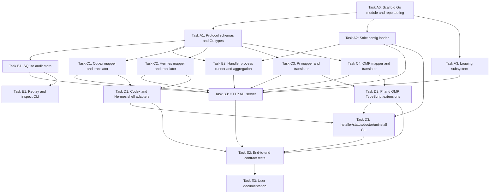

# Hitch Implementation Plan

Status: Proposed  
Date: 2026-06-04  
Primary ADR: `docs/adr/0001-hitch-architecture-and-technology-stack.md`

## Requirements Summary

Hitch is a local universal hook adapter for agent harnesses. Initial harnesses are Codex, Pi, OMP, and Hermes. Hitch receives native harness hook events, preserves native JSON payloads, maps them to a stable normalized Hitch envelope, dispatches user-configured handlers, persists event/handler records, and translates synchronous decisions back to each source harness when the native hook contract expects output.

Core decisions already aligned in ADR-0001:

- Go core daemon, CLI, persistence, aggregation, and logging.
- TypeScript where harness integration is naturally JS/TS, especially Pi/OMP extensions.
- User handlers are external commands first; no in-process plugin ABI in the first implementation.
- Two event paths:
  - async observer path: `POST /v1/events`
  - sync control path: `POST /v1/dispatch-sync`
- Operational logs use established logging frameworks and OpenTelemetry-compatible export.
- Event journal is separate from operational logs and initially persisted in SQLite with optional JSONL audit output.

## Target Repository Shape

This plan assumes a new repository rooted at `~/workspace/hitch`.

Expected initial structure after implementation:

```text
.
├── cmd/
│   └── hitch/
│       └── main.go
├── internal/
│   ├── api/
│   ├── audit/
│   ├── config/
│   ├── dispatch/
│   ├── harness/
│   │   ├── codex/
│   │   ├── hermes/
│   │   ├── pi/
│   │   └── omp/
│   ├── handlers/
│   ├── logging/
│   ├── protocol/
│   └── store/
├── adapters/
│   ├── codex/
│   ├── hermes/
│   ├── pi/
│   └── omp/
├── schemas/
├── testdata/
│   ├── codex/
│   ├── hermes/
│   ├── pi/
│   └── omp/
├── config/
│   └── default.config.toml
├── docs/
│   ├── adr/
│   └── plans/
├── .omx/
│   └── plans/
├── go.mod
├── go.sum
└── README.md
```

## Shared Contracts

These contracts are pre/post alignment points. Any parallel task that produces or consumes one of these contracts must not invent a parallel shape.

### C1: Normalized Event Envelope

Owner: Task A1.  
Consumers: API, store, dispatcher, all harness mappers, adapters, tests.

```json
{
  "hitch_version": "0.1.0",
  "event_id": "01J...",
  "received_at": "2026-06-04T00:00:00Z",
  "harness": "codex",
  "harness_version": "optional",
  "native_event_type": "PreToolUse",
  "native_payload": {},
  "hitch_event_type": "tool.requested",
  "session_id": "optional",
  "turn_id": "optional",
  "cwd": "optional",
  "model": "optional",
  "transcript_path": "optional",
  "payload": {}
}
```

Required event taxonomy for initial implementation:

```text
session.started
session.resumed
session.ended
session.compacted
turn.started
turn.user_prompt
turn.assistant_started
turn.completed
tool.requested
tool.permission_requested
tool.completed
subagent.started
subagent.completed
error.reported
```

Acceptance:

- Schema validates all golden mapped events.
- Unknown normalized event types are rejected unless explicitly configured as passthrough.
- Native payload is preserved as JSON without lossy stringification unless the adapter receives a non-JSON native value.

### C2: Handler Result

Owner: Task A1.  
Consumers: dispatcher, native response translators, store, tests.

```json
{
  "status": "ok",
  "decision": {
    "behavior": "none",
    "reason": "optional",
    "context": "optional",
    "updated_input": null,
    "updated_output": null,
    "native_response": null
  },
  "logs": [],
  "metrics": {}
}
```

Allowed `status` values:

```text
ok
error
timeout
```

Allowed `decision.behavior` values:

```text
none
allow
deny
block
continue
stop
transform
replace_result
inject_context
handled
```

Acceptance:

- Missing `decision` means `none`.
- Handler stderr/stdout are captured separately from parsed result.
- Invalid JSON from a handler becomes `status = error` and is persisted.

### C3: Deterministic Aggregation

Owner: Task B2.  
Consumers: sync API, native translators, control-path adapters.

Decision precedence:

```text
deny/block/stop > handled > transform/replace_result > inject_context > allow > none
```

Tie-breaking:

- Aggregation is by configured handler order, not completion order.
- Multiple context injections concatenate in configured handler order with two newlines.
- Multiple transforms are rejected unless the config marks the event as an ordered transform chain.
- Handler timeout/crash is ignored for decision unless event policy is `fail_closed`.

Acceptance:

- Tests prove that slower high-priority handler results still win according to configured order and precedence.
- Tests prove completion race does not change final native decision.

### C4: Native Response Translation

Owner: Task C1/C2/C3/C4 per harness.  
Consumers: adapters and sync API tests.

Translator input is a normalized Hitch aggregate result. Translator output is harness-native:

- Codex: stdout JSON shape or text/exit-code policy as required by event type.
- Hermes shell hooks: stdout JSON shape.
- Pi/OMP: JS callback return object and/or event mutation instruction.

Acceptance:

- Golden tests cover every return-capable event in the initial scope.
- Unsupported decision/event combinations fail safely and produce native no-op unless policy requires fail-closed.

### C5: Configuration

Owner: Task A2.  
Consumers: API, logging, store, dispatcher, adapters, installer.

Minimum config:

```toml
[server]
host = "127.0.0.1"
port = 8799
max_request_bytes = 1048576

[log]
level = "info"
format = "json"
include_native_payload = false

[log.stdout]
enabled = true

[log.file]
enabled = false
path = "~/.local/state/hitch/hitch.log"
max_size_mb = 100
max_backups = 10
max_age_days = 14
compress = true

[log.otlp]
enabled = false
endpoint = "http://127.0.0.1:4318"
protocol = "http/protobuf"

[audit]
enabled = true
backend = "sqlite"

[audit.sqlite]
path = "~/.local/share/hitch/events.sqlite"

[handlers]
# handler definitions live under [handlers.<name>]

[harness.codex]
enabled = true

[harness.hermes]
enabled = true

[harness.pi]
enabled = true

[harness.omp]
enabled = true
```

Handler example:

```toml
[handlers.audit]
command = ["hitch-handler-audit"]
events = ["*"]
mode = "async"
timeout_ms = 1000

[handlers.security_gate]
command = ["hitch-handler-security"]
events = ["tool.requested", "tool.permission_requested"]
mode = "sync"
timeout_ms = 750
on_error = "fail_open"
on_timeout = "fail_open"
```

Acceptance:

- Unknown sections/keys fail validation unless deliberately reserved.
- Invalid timeout, host, port, mode, or handler event reference fails startup.
- Environment override support is explicit and documented; do not silently read arbitrary env vars.

### C6: Persistence Schema

Owner: Task B1.  
Consumers: API, dispatcher, replay, tests.

Tables:

```text
inbound_events
normalized_events
handler_invocations
native_responses
```

Acceptance:

- All writes required for an accepted event are durable before API returns success for `/v1/events`.
- For `/v1/dispatch-sync`, inbound event, normalized event, handler invocations, aggregate decision, and emitted native response are persisted before response is returned unless the sync deadline forces a configured degraded path.
- Schema version is recorded.

## Task Graph

Legend:

- `A -> B`: B requires A's output contract.
- Tasks in the same row without dependency arrows may run in parallel.
- `SYNC POINT`: all listed upstream contracts must be merged before downstream starts.



## Execution Waves

### Wave 0: Foundation

Must run first.

- A0

### Wave 1: Independent core contracts

May run in parallel after A0.

- A1
- A2
- A3

### Wave 2: Core runtime and harness mapping

May run in parallel after relevant Wave 1 contracts.

- B1 depends on A1.
- B2 depends on A1 and A2.
- C1 depends on A1.
- C2 depends on A1.
- C3 depends on A1.
- C4 depends on A1.

### Wave 3: API integration

B3 begins only after B1, B2, A2, A3, and all C tasks provide stable interfaces.

- B3

### Wave 4: Native adapters and installer

May run in parallel after mappers/translators exist.

- D1 depends on C1 and C2.
- D2 depends on C3 and C4.
- D3 depends on A2 plus adapter paths from D1/D2; D3 can start with stubs but cannot finish before D1/D2.

### Wave 5: Replay, E2E, docs

- E1 depends on B1.
- E2 depends on B3, D1, D2, D3.
- E3 depends on E2 results.

## Detailed Tasks

### Task A0: Scaffold Go module and repo tooling

Parallelism: none; first task.

Context:

- The repository is new.
- ADR-0001 chooses Go core + TypeScript adapters + external command handlers.
- Do not implement business behavior in this task.

Inputs:

- ADR: `docs/adr/0001-hitch-architecture-and-technology-stack.md`

Changes:

- Create Go module.
- Create initial directory layout.
- Add baseline build/test tooling.
- Add `.gitignore` for Go, Node adapter dependencies, local DB/log output.
- Add initial `README.md` with project purpose and non-operational status.

Outputs:

- `go.mod`
- `cmd/hitch/main.go` placeholder that supports `hitch --version` or equivalent minimal command.
- Directory skeleton under `internal/`, `adapters/`, `schemas/`, `testdata/`, `config/`.

Acceptance:

- `go test ./...` runs successfully with placeholder packages.
- `go run ./cmd/hitch --version` returns a deterministic version string.

Post-alignment:

- A1/A2/A3 must use the package paths created here.
- No downstream task may rename the module path without updating all task outputs.

---

### Task A1: Protocol schemas and Go types

Parallelism: can run with A2 and A3 after A0.

Context:

- Owns contracts C1 and C2.
- Must not depend on any concrete harness implementation.
- Schema is the cross-language source of truth for Go core and TypeScript adapters.

Inputs:

- ADR envelope and handler result shapes.
- Event taxonomy from C1.

Changes:

- Create JSON schemas in `schemas/`:
  - `hitch-event-envelope.schema.json`
  - `handler-result.schema.json`
  - `dispatch-result.schema.json`
- Create Go types in `internal/protocol`.
- Add validation helpers for event type, harness name, and handler result.
- Add schema fixture tests using representative valid/invalid JSON.

Outputs:

- Stable Go types for:
  - `Harness`
  - `EventType`
  - `EventEnvelope`
  - `HandlerResult`
  - `Decision`
  - `AggregateDecision`
- JSON schemas matching those types.

Acceptance:

- Tests reject unknown harness values.
- Tests reject unknown normalized event types.
- Tests treat omitted handler `decision` as `none`.
- Tests reject invalid `decision.behavior`.

Post-alignment:

- B1 stores these types.
- B2 aggregates these results.
- C1-C4 return these event envelopes and aggregate decisions only.
- Any schema change after this task requires updating every golden fixture.

---

### Task A2: Strict config loader

Parallelism: can run with A1 and A3 after A0.

Context:

- Owns contract C5.
- Config path is `~/.config/hitch/config.toml`.
- Repository default config lives at `config/default.config.toml`.

Inputs:

- C5 config shape.
- ADR logging and handler decisions.

Changes:

- Implement `internal/config`.
- Add default config file.
- Add path expansion for `~` only where explicitly allowed.
- Validate unknown sections/keys strictly.
- Validate handler references to known normalized event names or wildcard `*`.
- Validate handler mode: `async` or `sync`.
- Validate error/timeout policy: `fail_open`, `fail_closed`, `native_default`.

Outputs:

- `config/default.config.toml`
- `internal/config` package with `Load`, `LoadDefault`, `Validate`.
- Config tests.

Acceptance:

- Missing user config can fall back to repository default for development.
- Invalid port, timeout, unknown key, unknown event, unknown mode, or unknown policy fails validation.
- Valid config round-trips into typed Go struct.

Post-alignment:

- B2 consumes handler config exactly as typed here.
- B3 consumes server limits exactly as typed here.
- D3 installer reads/writes only config fields defined here.

---

### Task A3: Logging subsystem

Parallelism: can run with A1 and A2 after A0.

Context:

- Operational logging is separate from event journal.
- Do not implement custom rotation.
- Use Go logging framework and rolling writer if file logging is enabled.

Inputs:

- C5 logging config.
- ADR logging decision.

Changes:

- Implement `internal/logging`.
- Choose `slog` unless a concrete need for `zap` is found during implementation.
- Add JSON and console formats.
- Add stdout sink.
- Add optional file sink using a rolling writer library, not manual rotation.
- Add optional OTLP initialization stub behind config; implementation can be minimal if dependencies are heavy, but public interface must not block future OTel support.

Outputs:

- Logger constructor taking typed config.
- Tests or smoke tests for format/sink selection.

Acceptance:

- Logs do not include native payload by default.
- File logging path expansion works through config path rules.
- Invalid file logging config is caught during config validation or logger initialization.

Post-alignment:

- B3 uses this logger.
- B1/B2 use structured log fields, not ad hoc prints.
- Operational logs must never be used as event persistence.

---

### Task B1: SQLite audit store

Parallelism: can run after A1; independent of B2/C tasks.

Context:

- Owns contract C6.
- Event journal is append-first.
- SQLite is initial backend.

Inputs:

- A1 protocol types.
- C6 schema.

Changes:

- Implement `internal/store`.
- Add SQLite migrations.
- Add insert/read APIs for:
  - inbound events
  - normalized events
  - handler invocations
  - native responses
- Add test DB helper using temp directory.

Outputs:

- Migration files or embedded SQL.
- Store interface and SQLite implementation.
- Store tests.

Acceptance:

- Tests insert inbound + normalized + handler invocation + native response and read them back.
- Native payload JSON is preserved byte-for-byte when possible, or semantically equivalent when normalized by JSON encoding.
- Schema version is recorded.

Post-alignment:

- B3 calls store before returning API success.
- E1 replay/inspect uses store interface only.

---

### Task B2: Handler process runner and aggregation

Parallelism: can run after A1 and A2; independent of B1/C tasks except protocol contract.

Context:

- Owns contract C3.
- User handlers are external commands.
- Sync path must obey deadlines.

Inputs:

- A1 protocol types.
- A2 handler config types.
- C3 aggregation rules.

Changes:

- Implement `internal/handlers` for external command invocation.
- Handler stdin receives normalized event envelope JSON.
- Handler stdout may contain handler result JSON.
- Handler stderr is captured as diagnostic output.
- Implement per-handler timeout.
- Implement total sync dispatch deadline.
- Implement deterministic aggregation.
- Add recursion guard env var for future LLM-backed handlers: `HITCH_CHILD=1` on child process.

Outputs:

- Handler runner.
- Dispatcher/aggregator package under `internal/dispatch` or `internal/handlers`.
- Tests with fake handler commands.

Acceptance:

- Tests prove handler stdout JSON parses into result.
- Tests prove invalid JSON becomes `status = error`.
- Tests prove timeout becomes `status = timeout`.
- Tests prove deny/block/stop precedence.
- Tests prove configured handler order determines tie-breaks, not completion order.
- Tests prove multiple context injections concatenate deterministically.
- Tests prove multiple transforms are rejected unless explicit chain config exists.

Post-alignment:

- B3 invokes this runner for both async and sync paths.
- C1-C4 translators consume only aggregate decisions emitted here.

---

### Task C1: Codex mapper and translator

Parallelism: can run after A1; independent of C2-C4.

Context:

- Codex command hooks use stdin JSON and stdout JSON/text depending event.
- Native event examples must live in `testdata/codex/`.

Inputs:

- A1 event envelope and handler result types.
- ADR Codex return contract findings.
- Codex docs referenced in ADR.

Changes:

- Implement `internal/harness/codex`.
- Map native Codex events into Hitch envelopes.
- Translate aggregate Hitch decisions into Codex-native response JSON.
- Cover at least:
  - `SessionStart`
  - `UserPromptSubmit`
  - `PreToolUse`
  - `PermissionRequest`
  - `PostToolUse`
  - `SubagentStart`
  - `SubagentStop`
  - `Stop`
  - `PreCompact`
  - `PostCompact`

Outputs:

- Codex mapper.
- Codex response translator.
- Golden fixtures and tests.

Acceptance:

- Golden native payloads map to expected normalized event types.
- `PermissionRequest` deny maps to Codex `hookSpecificOutput.decision.behavior = deny` shape.
- `PreToolUse` deny maps to `permissionDecision = deny`.
- `PreToolUse` transform maps to `permissionDecision = allow` plus `updatedInput`.
- Unsupported decision/event combinations return native no-op or configured fail-closed result.

Post-alignment:

- D1 shell adapter calls this through API, not by duplicating mapping logic.
- B3 imports translator only through a harness-neutral interface.

---

### Task C2: Hermes mapper and translator

Parallelism: can run after A1; independent of C1/C3/C4.

Context:

- Hermes shell hooks receive JSON stdin and return JSON stdout.
- Hermes plugin hooks are out of initial adapter runtime scope but inform event taxonomy.

Inputs:

- A1 event envelope and handler result types.
- ADR Hermes return contract findings.
- Hermes docs referenced in ADR.

Changes:

- Implement `internal/harness/hermes`.
- Map shell-hook payloads into Hitch envelopes.
- Translate aggregate decisions into Hermes stdout JSON.
- Cover at least:
  - `pre_tool_call`
  - `post_tool_call`
  - `pre_llm_call`
  - `post_llm_call`
  - `on_session_start`
  - `on_session_end`
  - `subagent_stop`
  - transform-style hooks if supported by shell payload fixtures.

Outputs:

- Hermes mapper.
- Hermes response translator.
- Golden fixtures and tests.

Acceptance:

- `pre_tool_call` block maps to `{"action":"block","message":"..."}` or accepted compatible shape.
- `pre_llm_call` context injection maps to `{"context":"..."}`.
- Observer hooks map to no-op response.
- Invalid/unknown Hermes native events are rejected unless configured passthrough.

Post-alignment:

- D1 shell adapter calls Hitch API and emits translator output.
- B3 imports translator only through harness-neutral interface.

---

### Task C3: Pi mapper and translator

Parallelism: can run after A1; independent of C1/C2/C4.

Context:

- Pi extension callbacks return JS objects or mutate event inputs.
- Hitch daemon remains Go; TypeScript adapter consumes a daemon response.

Inputs:

- A1 event envelope and handler result types.
- ADR Pi return contract findings.
- Pi docs referenced in ADR.

Changes:

- Implement `internal/harness/pi` mapping and response model.
- Define a JSON response shape for TypeScript adapter consumption, for example:

```json
{
  "adapter_action": "noop | return | mutate_and_return",
  "return_value": {},
  "mutations": [
    { "path": ["input", "command"], "value": "..." }
  ]
}
```

- Cover at least:
  - `input`
  - `tool_call`
  - `tool_result`
  - `context`
  - `before_provider_request`
  - `user_bash`
  - key session pre-events that can cancel/customize.

Outputs:

- Pi mapper.
- Pi adapter-response translator.
- Golden fixtures and tests.

Acceptance:

- `input` transform maps to Pi `{ action: "transform", text, images? }` through adapter response.
- `input` handled maps to `{ action: "handled" }`.
- `tool_call` block maps to `{ block: true, reason }`.
- `tool_call` transform maps to mutation instructions for `event.input`, not returned input.
- `tool_result` replacement maps to patch object.

Post-alignment:

- D2 TypeScript extension applies mutation instructions exactly and returns `return_value` exactly.
- OMP may reuse Pi translator if contract remains compatible.

---

### Task C4: OMP mapper and translator

Parallelism: can run after A1; independent of C1-C3, but should coordinate with C3 for shared Pi-compatible helpers.

Context:

- OMP appears Pi-compatible from Agent Pulse extension experience.
- Treat OMP as Pi-compatible until fixtures prove divergence.

Inputs:

- A1 event envelope and handler result types.
- C3 Pi response model if already available.
- Existing Agent Pulse OMP extension behavior from `../sentiment-viewer/.omp/extensions/agent-pulse.js` can inform event list.

Changes:

- Implement `internal/harness/omp`.
- Reuse Pi-compatible mapper/translator where correct.
- Add OMP-specific event names observed in Agent Pulse:
  - `input`
  - `before_agent_start`
  - `turn_start`
  - `tool_call`
  - `tool_result`
  - `turn_end`
  - `auto_compaction_start`
  - `todo_reminder`

Outputs:

- OMP mapper/translator.
- Golden fixtures and tests.

Acceptance:

- OMP fixtures map to normalized taxonomy.
- Pi-compatible return-capable events use the same adapter response shape as C3.
- OMP-only observer events map to async-safe no-op native responses.

Post-alignment:

- D2 TypeScript OMP extension consumes the same adapter response contract as Pi where possible.

---

### Task B3: HTTP API server

Parallelism: starts only after B1, B2, A2, A3, and C1-C4 have stable interfaces.

Context:

- Integrates contracts C1-C6.
- Must enforce request size limits and loopback-safe defaults.

Inputs:

- A1 protocol types.
- A2 config.
- A3 logging.
- B1 store.
- B2 dispatcher.
- C1-C4 harness mappers/translators.

Changes:

- Implement `internal/api`.
- Add routes:
  - `POST /v1/events`
  - `POST /v1/dispatch-sync`
  - `GET /v1/health`
  - `GET /v1/events/:id`
  - `POST /v1/replay` can be stubbed to call E1 later only if route contract is explicit.
- Enforce max request bytes.
- Route by harness + native event type.
- Persist inbound and normalized events.
- Dispatch async handlers without affecting native control flow.
- Dispatch sync handlers within deadline and persist native response.

Outputs:

- API server package.
- Main command starts server with config.
- API tests using httptest.

Acceptance:

- `/v1/health` returns ok without DB corruption.
- `/v1/events` persists inbound + normalized event and returns event id.
- `/v1/dispatch-sync` persists inbound + normalized + handler invocation + native response and returns aggregate result.
- Oversized request is rejected before full processing.
- Unknown harness is rejected.
- Handler failure is persisted and does not panic server.

Post-alignment:

- D1/D2 call these endpoints only.
- E2 uses public API, not internal function calls, for end-to-end tests.

---

### Task D1: Codex and Hermes shell adapters

Parallelism: can run after C1 and C2; can run with D2.

Context:

- Shell adapters are thin native-hook entrypoints.
- They must fail open by default for observer events.
- They must emit native response for sync control events.

Inputs:

- C1 Codex native response contract.
- C2 Hermes native response contract.
- B3 API request/response shape.
- A2 endpoint config conventions.

Changes:

- Create adapter scripts/binaries under:
  - `adapters/codex/`
  - `adapters/hermes/`
- Read native payload from stdin.
- Determine harness and native event type.
- POST to Hitch `/v1/dispatch-sync` for return-capable events.
- POST to Hitch `/v1/events` for observer-only events.
- Write native response JSON/text to stdout as required.
- Fail open if Hitch is unreachable unless event policy requires fail-closed and policy is locally available.

Outputs:

- Codex shell adapter.
- Hermes shell adapter.
- Unit tests with fake server.

Acceptance:

- Adapter sends exact stdin payload as `native_payload`.
- Adapter prints valid JSON for Codex events that require JSON on stdout.
- Adapter prints valid JSON for Hermes shell hooks.
- Network failure returns no-op success for observer events.
- Network failure behavior for sync events matches documented default.

Post-alignment:

- D3 installer references adapter paths generated here.
- E2 uses these adapters for end-to-end tests.

---

### Task D2: Pi and OMP TypeScript extensions

Parallelism: can run after C3 and C4; can run with D1.

Context:

- Pi/OMP extensions run in JS/TS callback environment.
- They must apply Hitch mutation instructions correctly.

Inputs:

- C3/C4 adapter response contracts.
- B3 API request/response shape.
- A2 endpoint config conventions.

Changes:

- Create TypeScript extension sources under:
  - `adapters/pi/`
  - `adapters/omp/`
- Register callbacks for initial event scope.
- For return-capable events, call `/v1/dispatch-sync`.
- For observer events, call `/v1/events` and return native no-op/continue.
- Apply mutation instructions before returning from callback.
- Add recursion guard `HITCH_CHILD=1` behavior: if present, extension no-ops.

Outputs:

- Pi extension.
- OMP extension.
- Tests for adapter response application.

Acceptance:

- `tool_call` mutation instructions mutate `event.input` in place.
- `tool_call` block returns `{ block: true, reason }`.
- `input` transform/handled/continue returns correct Pi shape.
- `tool_result` patch returns correct patch shape.
- Hitch unreachable fails open for observer events and documented fallback for control events.

Post-alignment:

- D3 installer installs these extensions.
- E2 runs adapter unit/e2e tests.

---

### Task D3: Installer/status/doctor/uninstall CLI

Parallelism: can start after A2; finish after D1 and D2 paths stabilize.

Context:

- Agent Pulse showed installer/doctor is part of the product.
- Mutating user harness config must be explicit, idempotent, and backed up.

Inputs:

- A2 config paths.
- D1 adapter paths.
- D2 extension paths.
- Harness install locations from ADR/research:
  - Codex: `~/.codex/hooks.json` or config hooks.
  - Hermes: `~/.hermes/config.yaml` hooks block.
  - Pi: `~/.pi/agent/extensions/`.
  - OMP: extension install path or `omp install` path when available.

Changes:

- Add CLI subcommands:
  - `hitch install --all|--only <list> --dry-run --yes --json`
  - `hitch status --json`
  - `hitch doctor --json`
  - `hitch uninstall --all|--only <list> --yes --json`
- Write managed integration files under `~/.config/hitch/integrations/`.
- Write backups under `~/.config/hitch/backups/` before patching user config.
- Use managed block markers for patched files.
- Avoid shell aliases.

Outputs:

- Installer CLI implementation.
- Dry-run diff model.
- Status/doctor reports.
- Tests using temp HOME.

Acceptance:

- Dry-run does not mutate filesystem.
- Install is idempotent.
- Uninstall removes only managed Hitch entries.
- Existing unrelated hooks/config are preserved.
- Backups are created before every patch.
- JSON output is machine-readable and stable.

Post-alignment:

- E2 validates install/status/uninstall in temp HOME.
- E3 documents install/doctor/trust workflows.

---

### Task E1: Replay and inspect CLI

Parallelism: can run after B1; can run before D tasks finish.

Context:

- Replay is essential for adapter development and handler debugging.

Inputs:

- B1 store interface.
- B2 handler runner if replay can re-run handlers.

Changes:

- Add CLI commands:
  - `hitch inspect-event <id> --json`
  - `hitch replay <id> [--handler <name>] [--dry-run] --json`
- Replay reads persisted inbound/normalized events.
- Replay can re-run configured handlers without modifying original records; new invocations must reference replay source id.

Outputs:

- Inspect/replay CLI.
- Tests using temp SQLite DB.

Acceptance:

- Inspect returns inbound, normalized, handler invocation, and native response records.
- Replay does not mutate original event records.
- Replay records new handler invocation records with replay metadata when not dry-run.

Post-alignment:

- E3 documents replay for handler development.

---

### Task E2: End-to-end contract tests

Parallelism: starts after B3, D1, D2, D3.

Context:

- This is the integration gate before documentation claims.

Inputs:

- Public CLI/API/adapters only.
- Golden fixtures from C1-C4.

Changes:

- Add end-to-end tests that launch Hitch on a random local port.
- Exercise shell adapters against fake Codex/Hermes payloads.
- Exercise TypeScript adapter response application for Pi/OMP.
- Exercise installer in temp HOME.
- Exercise SQLite persistence.

Outputs:

- E2E test suite.
- Test fixtures and helper scripts.

Acceptance:

- Codex `PreToolUse` deny fixture produces native Codex deny JSON.
- Codex `PermissionRequest` allow/deny fixtures produce correct native JSON.
- Hermes `pre_tool_call` block fixture produces Hermes block JSON.
- Pi/OMP `tool_call` transform fixture mutates input in place.
- Async event persists inbound + normalized records and returns quickly.
- Sync event persists handler invocation and native response.
- Installer dry-run/install/status/uninstall works in temp HOME without touching real user config.

Post-alignment:

- E3 may only claim behavior covered by these tests.

---

### Task E3: User documentation

Parallelism: starts after E2 proves behavior.

Context:

- Documentation must not overclaim unsupported harness behavior.

Inputs:

- E2 verified behavior.
- D3 installer commands.
- Config schema from A2.

Changes:

- Update `README.md`.
- Add docs:
  - `docs/configuration.md`
  - `docs/installation.md`
  - `docs/handler-protocol.md`
  - `docs/harness-contracts.md`
  - `docs/replay.md`

Outputs:

- User-facing docs.

Acceptance:

- Docs include exact config path: `~/.config/hitch/config.toml`.
- Docs include fail-open/fail-closed behavior.
- Docs explain operational logs vs event journal.
- Docs include handler stdin/stdout contract.
- Docs include native harness trust/consent notes where applicable.
- Every documented command exists and is covered by tests or marked experimental.

Post-alignment:

- No implementation task may add new documented behavior without test coverage.

## Parallel Execution Assignments

If using parallel agents, use these assignments. Each assignment is self-contained and names pre/post contracts.

### Assignment 1: Protocol and Schemas

Tasks: A1.  
May run after: A0.  
Must produce: C1, C2.  
Must not implement: storage, API, harness-specific mapping.

Complete context:

- Implement JSON schemas and Go types for Hitch event envelope and handler result exactly as defined in this plan.
- Use normalized event taxonomy exactly as listed.
- Add tests for valid/invalid event envelopes and handler results.
- Downstream packages will import `internal/protocol` and must not duplicate enums.

### Assignment 2: Config and Logging

Tasks: A2, A3.  
May run after: A0.  
Must produce: C5 and logging constructor.  
Must not implement: handler execution, API routing, persistence.

Complete context:

- Implement strict TOML config loader and default config.
- Unknown keys fail validation.
- Implement operational logging with stdout/file/OTLP config shape.
- Do not log native payload by default.
- Do not implement custom log rolling; use an existing writer if file rotation is enabled.

### Assignment 3: Store

Tasks: B1.  
May run after: A1.  
Must produce: C6.  
Must not implement: HTTP routes or handler execution.

Complete context:

- Implement SQLite audit store with append-first tables.
- Store inbound native JSON, normalized JSON, handler invocation records, and native responses.
- Add temp DB tests.
- Public store interface is consumed by API and replay CLI.

### Assignment 4: Handler Runner and Aggregator

Tasks: B2.  
May run after: A1 and A2.  
Must produce: C3.  
Must not implement: harness translators or HTTP routes.

Complete context:

- External command handlers receive event envelope JSON on stdin.
- Parse handler result JSON from stdout.
- Capture stdout/stderr and status separately.
- Implement timeouts and deterministic aggregation.
- Precedence and tie-breaking are exactly C3.

### Assignment 5: Codex Harness

Tasks: C1.  
May run after: A1.  
Must produce: Codex mapper/translator and golden tests.  
Must not implement: shell adapter network client or installer.

Complete context:

- Map Codex native payloads into Hitch envelope.
- Translate aggregate decisions back to Codex stdout JSON.
- Cover return-capable Codex events listed in this plan.
- Unsupported decision/event combinations must be native no-op unless configured fail-closed.

### Assignment 6: Hermes Harness

Tasks: C2.  
May run after: A1.  
Must produce: Hermes mapper/translator and golden tests.  
Must not implement: shell adapter network client or installer.

Complete context:

- Map Hermes shell-hook payloads into Hitch envelope.
- Translate aggregate decisions to Hermes stdout JSON.
- Cover return-capable Hermes events listed in this plan.

### Assignment 7: Pi/OMP Harnesses

Tasks: C3, C4.  
May run after: A1.  
Must produce: shared adapter response contract for JS extensions plus Pi and OMP mapper/translator tests.  
Must not implement: actual TypeScript extensions.

Complete context:

- Pi/OMP callback adapters need JSON instructions from daemon because returns/mutations happen in JS.
- Define adapter response shape once and reuse it for Pi and OMP where compatible.
- `tool_call` input changes are mutation instructions, not returned input.

### Assignment 8: API Server

Tasks: B3.  
May run after: A1, A2, A3, B1, B2, C1, C2, C3, C4.  
Must produce: public REST API.  
Must not implement: installer or docs.

Complete context:

- Implement `/v1/events`, `/v1/dispatch-sync`, `/v1/health`, `/v1/events/:id`.
- Enforce request size.
- Persist before returning success.
- Use harness-neutral mapper/translator interfaces.

### Assignment 9: Native Adapters

Tasks: D1, D2.  
May run after: C1-C4 and B3 API contract.  
Must produce: Codex/Hermes shell adapters and Pi/OMP TypeScript extensions.  
Must not implement: installer.

Complete context:

- Shell adapters read JSON stdin and write native stdout response.
- TS adapters register callbacks and apply Hitch adapter response instructions.
- All adapters fail open for observer events if Hitch is unreachable.
- Include recursion guard behavior for `HITCH_CHILD=1`.

### Assignment 10: Installer CLI

Tasks: D3.  
May start after A2; finish after D1/D2.  
Must produce: install/status/doctor/uninstall.  
Must not modify real user config in tests.

Complete context:

- Idempotent managed installs.
- Dry-run mode must not mutate.
- Back up before patching user config.
- Preserve unrelated hooks.
- Use temp HOME tests.

### Assignment 11: Replay/Inspect and E2E

Tasks: E1, E2.  
May run E1 after B1; E2 after B3/D1/D2/D3.  
Must produce: verification gate.  
Must not document unverified behavior.

Complete context:

- Inspect reads persisted records.
- Replay re-runs handlers without mutating originals.
- E2E tests must exercise public CLI/API/adapters.
- E2 gates docs.

### Assignment 12: Documentation

Tasks: E3.  
May run after E2.  
Must produce: user docs matching verified behavior only.

Complete context:

- Document config, install, handler protocol, harness return behavior, replay, logging vs audit.
- Do not claim untested behavior.

## Acceptance Criteria

The implementation is complete when all criteria are met:

1. `hitch` starts a local API service bound to `127.0.0.1` by default.
2. `POST /v1/events` accepts a supported native harness event, maps it, persists inbound + normalized records, and returns an event id.
3. `POST /v1/dispatch-sync` accepts a supported control event, runs configured handlers with deadlines, persists handler invocations, aggregates deterministically, persists native response, and returns the aggregate decision.
4. Codex mapper/translator covers the initial return-capable Codex event list.
5. Hermes mapper/translator covers the initial return-capable Hermes event list.
6. Pi/OMP adapter response contract supports input transform/handled, tool_call block/mutation, and tool_result patch.
7. External command handlers work with stdin envelope JSON and stdout handler result JSON.
8. Invalid handler output is persisted as an error and does not crash the daemon.
9. Timeout behavior follows configured `fail_open`, `fail_closed`, or `native_default` policy.
10. SQLite stores inbound events, normalized events, handler invocations, and native responses.
11. Operational logs are structured and exclude native payload by default.
12. File log rotation uses an existing library or platform mechanism, not custom rotation logic.
13. Installer dry-run/status/install/uninstall work idempotently in temp HOME tests.
14. Replay and inspect commands operate on stored event records.
15. E2E tests prove at least one async event and one sync control event for Codex, Hermes, and Pi/OMP adapter response behavior.

## Verification Plan

Run these gates after implementation:

```sh
go test ./...
```

If TypeScript adapters use npm tooling, also run their specific test command from the adapter package directory.

Behavioral gates:

- Unit: protocol schema validation, config validation, store CRUD, aggregation precedence, native translators.
- Integration: HTTP API with temp SQLite and fake handler commands.
- Adapter: shell adapters with fake Hitch server; TS adapter response application tests.
- Installer: temp HOME dry-run/install/status/uninstall.
- E2E: launch Hitch on random local port, send golden native payloads through adapters, assert persisted records and native outputs.

## Risks and Mitigations

| Risk | Mitigation |
|---|---|
| Protocol drift between Go and TypeScript | JSON schemas and golden fixtures are source of truth. |
| Sync handler latency blocks harness | Per-handler timeout + total deadline + configured fallback policy. |
| Native payloads contain secrets | Exclude from operational logs by default; add redaction before wider exports. |
| Multiple transforms conflict | Reject multiple transforms unless explicit ordered chain is configured. |
| Adapter outage disrupts agent work | Fail open for observer events; explicit policy for control events. |
| Installer corrupts user config | Dry-run, backups, managed markers, temp HOME tests. |
| OMP diverges from Pi | Keep OMP mapper separate even if it shares Pi-compatible helpers. |

## Open Decisions Before Implementation

These do not block scaffolding, but must be resolved before shipping:

1. Whether to use `slog` or `zap` for operational logs.
   - Default recommendation: `slog` first, switch only if concrete field/performance issues appear.
2. Whether SQLite uses pure-Go `modernc.org/sqlite` or CGO `mattn/go-sqlite3`.
   - Default recommendation: pure-Go first for distribution simplicity.
3. Whether Codex/Hermes shell adapters are tiny Go binaries or Node scripts.
   - Default recommendation: choose the simplest implementation that can be installed reliably; long-term installer can generate scripts if needed.
4. Whether the initial `/v1/replay` route is fully implemented in API or only CLI-backed.
   - Default recommendation: implement CLI first; API route can be added once replay semantics are stable.
